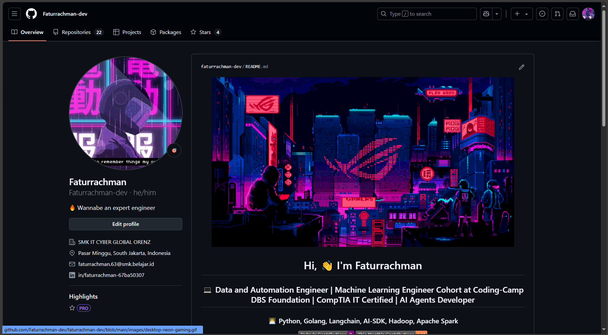

Here's a breakdown of what to include, tailored for informing an AI coding assistant:

**I. Core Identity & Purpose**

1. **About Me (The Developer & Prompt Engineer):**

   * **Name/Handle:** Faturrachman
   * **Headline/Tagline:** Innovative Developer & AI Prompt Architect
   * **Brief Bio (Elevator Pitch - 2-3 sentences):** I'm Faturrachman, a developer specializing in Python and a prompt engineer focused on leveraging LLMs for creative and technical solutions. I love building intuitive applications and exploring the intersection of code and AI.
   * **Key Skills (Categorized):**
     * **Development:** Languages (Python, JS), Frameworks (React/Next.js), Databases (SQL, PostgreSQL), Tools (Git, Docker, MCP).
     * **Prompt Engineering:**
       LLMs used:
       Creative Writing	  : Gemini 2.5 Pro & 2.5 Preview
       Coding          		: Claude 3.7 Sonnet, Gemini 2.5 Pro, Mistral's Devstrall
       Images          		: Leonardo AI, ComfyUI, Google Imagen
       Videos          		: Google Veo 2
       Music			        : Suno AI
       Experimentations	: Deepseek and Qwen Models
     * **Prompting Techniques**: Few-shot, Chain-of-Thought, Iterative, Zero-shot with Rich Context Provision.
       Use Cases: Code gen, creative writing for documentations, AI Image generations, AI Video Generations
     * **Other Relevant Skills:** UI design, project management, technical writing.
   * **Personal Brand/Vibe:** What feeling should your portfolio convey?
     "modern," "minimalist," "tech-innovative," "approachable," "creative," "clean," "professional."
2. **Website Purpose & Goals:**

   * **Primary Goal:** (showcase expertise to the community, attract freelance clients, find a full-time job).
   * **Target Audience:** Recruiters, potential clients, fellow developers, non-technical stakeholders. This influences tone and complexity.
   * **Key Message:** What's the one thing you want visitors to take away?
     to get know more about me, and potentially be clients or recruiters.

**II. Website Structure & Content**

1. **Key Sections/Pages:**

   * **Homepage:** Overview, highlights, snipptets of experties.
   * **About Me:** More detailed version of the bio, perhaps with your journey/philosophy.
   * **Portfolio/Projects:** The core.
   * **Skills:** Integrated into About me (core), and Project's skills-used
   * **Blog/Articles:** i plan to make this, but not on the current web creation, so no.
   * **Contact:** How people can reach you (whatsapp social links, email).
   * **Resume/CV:** (Link to a PDF).

2. **Portfolio Projects (Crucial Detail!):**
   For *each* project you want to feature, provide:

   * **Project Title:**
   * **One-Liner Description:**
   * **Detailed Description:** What was the problem/challenge? What was your solution? What was the outcome/impact?
   * **Your Role:** (e.g., Lead Developer, Prompt Engineer, Contributor).
   * **Technologies/Skills Used:** Be specific (e.g., Python, Flask, OpenAI API, GPT-3.5-turbo, React, Figma).
   * **Key Features/Highlights (3-5 bullet points):** What are you most proud of? What's unique?
   * **Links:** GitHub repo, live demo (if any).
   * **Visuals:** Mention if you have screenshots, mockups, or videos. If not, ask the AI to suggest placeholder types.
     * *Example for AI:* "For Project X, I need a section displaying its title, a short description, a list of tech used, and a link to its GitHub. Suggest a layout for this project card."
     
3. **Content Tone & Style:**

   * Formal, informal, conversational, technical, witty?
   * *Example for AI:* "Write the project descriptions in a professional but engaging tone, highlighting the problem-solving aspect. For blog post ideas, aim for an informative and slightly informal tone suitable for other developers."

**III. Design & Technical Specifications**

1. **Design Preferences (Visuals):**

   * **Overall Aesthetic:** Refer back to "Personal Brand/Vibe" keywords
   * **Color Palette (if you have one):** 
    Primary: rgb(13,17,23) 
    secondary: rgb(118,70,168) 
    colours of primary and secondary are from the looks of my github profile
   * **Typography (if you have preferences):** Sans-serif for readability is common for tech.
   * **Inspiration Websites (Links):** i like the view of my github profile. the github's dark colour and my profile's neon colours ( purples, bright whites, etc. ) 
2. **Technical Constraints & Preferences:**

   * **Platform:** GitHub Pages (you've decided this).
   * **Static Site Generator (Optional but Recommended for GitHub Pages):** just plain HTML/CSS/JS.
   * **Responsiveness:** Must be mobile-friendly.
   * **Accessibility (a11y):** Aim for good practices (semantic HTML, alt text).
   * **Specific Features:**
     * Whatsapp quick message to my number.
     * provide high-level overview of the portfolio showcases.
     * Modern Dark Web

**IV. Instructions for the AI**

1. **Your Role (AI's Role):** "You are my AI Web Developer and Content Assistant. Your goal is to help me build a portfolio website on GitHub Pages based on the information in this document."
2. **Mode of Interaction:** "I will ask you to generate code snippets (HTML, CSS, JS), suggest layouts, write draft content, and help me refine ideas."
3. **Iterative Process:** "We will build this iteratively. I'll ask for specific components or sections."
4. **Clarification:** "If any part of my request is unclear, please ask for clarification before proceeding."
5. **Source of Truth:** "Refer to this document as the primary source of information about me and my project."

**How to "Give" this to the AI:**

* **Large Context Window Models:** For models like GPT-4, Claude 2, etc., you can often paste a significant portion (or all) of this document directly into the chat at the beginning of your session.
* **Chunking:** If the document is too long, or if you're using an AI with a smaller context window, you can:
  * Provide it in sections: "Here's the 'About Me' section. Now, here's information about my first project..."
  * Summarize and refer: "Remember the overall vibe I'm going for (modern, tech-forward). Now, let's design the hero section."
* **Reference:** Keep this document open and copy-paste relevant parts when making specific requests. "Based on Project X details I provided earlier, generate a project card."

**Why this works for AI:**

* **Reduces Ambiguity:** The AI has a clear reference point.
* **Ensures Consistency:** Helps maintain a consistent tone, style, and information across the site.
* **Saves Time:** You don't have to repeat basic information in every prompt.
* **Better Output:** The more context the AI has, the more relevant and tailored its suggestions and code will be.

By preparing this "AI Briefing Document," you're essentially doing high-quality prompt engineering for your entire website project. Good luck – it sounds like a fantastic portfolio in the making!
